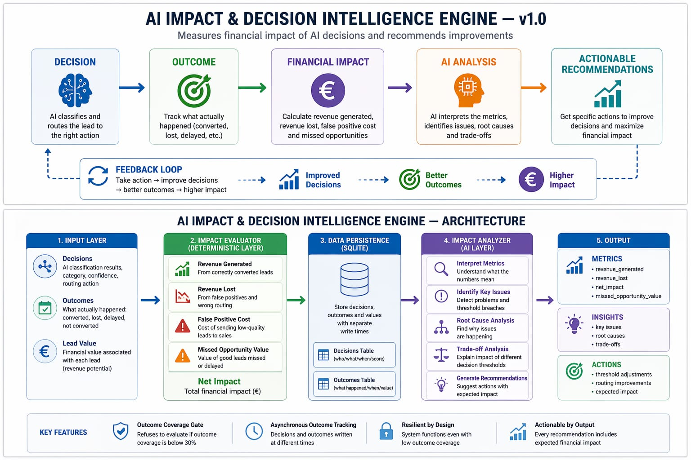
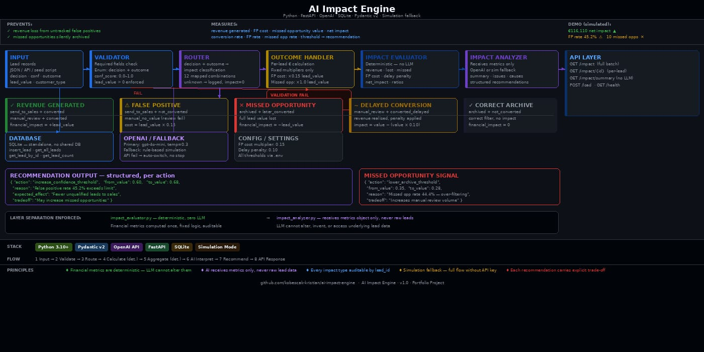

# AI Impact & Decision Intelligence Engine — v1.0

Most AI systems make decisions.

Very few know if those decisions were actually correct.

Even fewer measure what those decisions actually cost.

This system measures the financial impact of AI lead routing decisions and recommends how to improve them.

**System design | AI evaluation pipeline | FastAPI + Python**

---



---

## The Problem

AI systems route leads (send to sales, archive, manual review), but almost no system measures the **financial consequence of those decisions**.

As a result:

- False positives waste sales effort  
- Missed opportunities lose revenue silently  
- No feedback loop exists to improve decision thresholds  

**Who has this problem:**

- Revenue operations teams  
- AI automation builders  
- Sales ops managing lead qualification pipelines  

---

## Why This Matters

Most AI systems optimise accuracy.

This system optimises **business impact**.

It shows:

- What decisions generated revenue  
- What decisions lost money  
- Where thresholds are misaligned  
- What to change to improve outcomes  

---

## What This System Does

This system acts as a **decision intelligence layer** on top of an existing AI pipeline.

It connects:

**Decision → Outcome → Financial Impact → Recommendation**

It does NOT make business decisions.

It evaluates them and translates them into measurable financial consequences.

---

## Outcome (Simulated)

- 75 leads processed  
- Revenue generated: €165,170  
- Revenue lost: €49,060  
- Net impact: €116,110  

- Conversion rate: 41.3%  
- False positive rate: 45.2%  
- Missed opportunity rate: 44.4%  

- 4 structured recommendations generated  

**Note:**  
Dataset intentionally constructed to produce both positive and negative outcomes for evaluation demonstration.

---

## Architecture



---

## How It Works

Pipeline:

1. Input validation  
2. Impact classification (maps decision + outcome → financial category)  
3. Per-lead financial calculation  
4. Aggregate metrics computation  
5. AI interpretation (metrics only)  
6. Recommendation generation  
7. API response  

---

## Business Value

- Makes hidden revenue loss visible  
- Quantifies cost of wrong AI decisions  
- Enables threshold optimisation  
- Reduces reliance on manual analysis  
- Creates a continuous feedback loop  

---

## Example

### Input

```json
{
  "decision": "archived",
  "confidence": 0.38,
  "outcome": "later_converted",
  "lead_value": 5500
}
